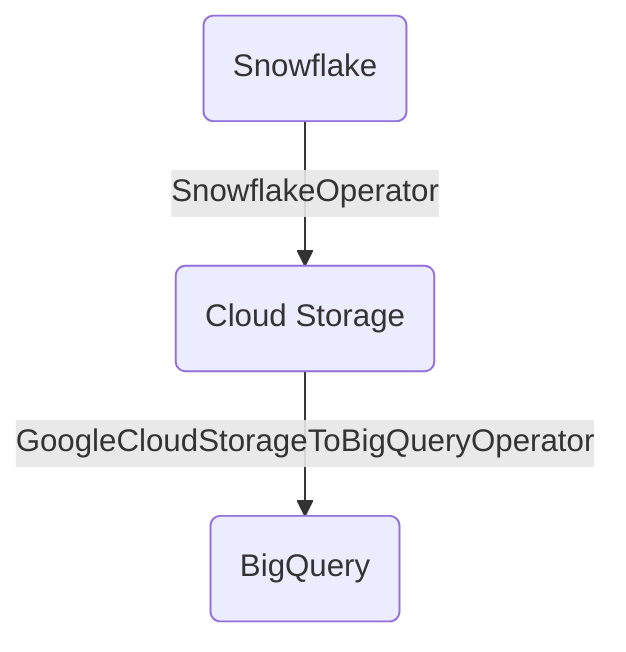

# TL;DR

A simple two stage Airflow DAG used to ingest data from Snowflake into BigQuery. The data is first exported from Snowflake to GCS using the [COPY INTO](https://docs.snowflake.com/en/sql-reference/sql/copy-into-table) statement and then loaded from GCS into BigQuery using a BigQuery [Batch Job](https://cloud.google.com/bigquery/docs/batch-loading-data).

# Architecture



# SnowflakeOperator

The [SnowflakeOperator](https://airflow.apache.org/docs/apache-airflow-providers-snowflake/stable/operators/snowflake.html) Airflow operator executes SQL on the Snowflake instance running in GCP. The SQL script can be injected directly using a statement or via an external _.sql_ file.

Two connections must be established to execute the `COPY INTO` statement.

## 1. Airflow Authentication to Snowflake

Airflow authenticates with Snowflake using credentials saved in Airflow >> Admin >> Connections. A Snowflake connection type is added if the operator PyPy package is installed. This package can be found [here](https://pypi.org/project/apache-airflow-providers-snowflake/).

## 2. Snowflake Authentication to GCS

Authentication with Google Cloud Storage uses a Service Account issued by Snowflake. First a [Storage Integration](https://docs.snowflake.com/en/sql-reference/sql/create-storage-integration) is created for one or more buckets. For this example project I created the following integration.

```SQL
CREATE STORAGE INTEGRATION gcs_integration
TYPE = EXTERNAL_STAGE STORAGE_PROVIDER = 'GCS'
ENABLED = TRUE STORAGE_ALLOWED_LOCATIONS = ('gcs://snowflake-landing/faa/');
```

Next the [DESC STORAGE INTEGRATION](https://docs.snowflake.com/en/sql-reference/sql/desc-integration) statement is used to locate the Service Account used for authentication.

```SQL
DESC STORAGE INTEGRATION gcs_integration;
```

Lastly, the service account must be granted the following permissions:

1. _storage.buckets.get_
2. _storage.objects.get_
3. _storage.objects.list_

# Setup

This project includes a yaml file for deployment to Google Cloud using Github Actions. The Github Action Workflow requires an _"Action Secret"_ used to set environment variables during deployment. Set the following secrets in the repository before deployment.

| Action Secret | Value                                                          |
| ------------- | -------------------------------------------------------------- |
| GCP_SA_KEY    | Service Account Key used to authenticate GitHub to GCP Project |

The deployment yaml file found in `/.github/workflows/` defines the setup in two stages; a build stage followed by a deploy stage. Notice the `Delete previous DAG version` step has `continue-on-error: true`; this allows the step to progress even if the DAG has not yet been created. These stages are described in detail below:

1. Build
   > - Authentication with GCP - [auth](https://github.com/google-github-actions/auth)
   > - Upload DAG folder as repository artifact - [upload-artifact](https://github.com/actions/upload-artifact)
   > - Upload repository artifact to Cloud Storage - [upload-cloud-storage](https://github.com/google-github-actions/upload-cloud-storage)
2. Deploy
   > - Authentication with GCP - [auth](https://github.com/google-github-actions/auth)
   > - Setup Google Cloud SDK - [setup-gcloud](https://github.com/google-github-actions/setup-gcloud)
   > - Install [kubectl](https://cloud.google.com/kubernetes-engine/docs/how-to/cluster-access-for-kubectl) - required to remove previous DAG versions from Cloud Composer _(note: the .py files are not removed from GCS)_
   > - Delete previous DAG version; [docs](https://cloud.google.com/composer/docs/how-to/using/managing-dags#deleting_a_dag)
   > - Deploy Cloud Composer SDK; [docs](https://cloud.google.com/composer/docs/how-to/using/managing-dags#adding)
