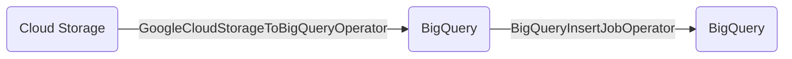
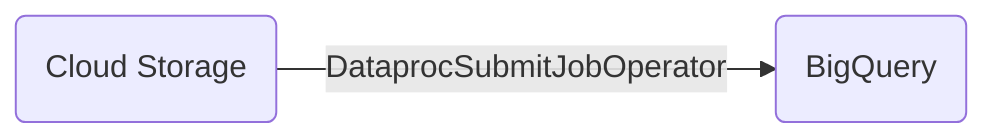

# TL;DR

Two simple Cloud Composer Airflow DAGs _(Directed Acyclic Graph)_ that copy partitioned Parquet files from Google Cloud Storage into BigQuery. The partitioned files contain stock data ingested via the [Alpaca](https://alpaca.markets/) Market Data API. Follow [this template](https://github.com/FioChuck) for tips on interfacing with the API. Both workflows aggregate trade samples into daily buckets and save the summarized results into BigQuery.

This repo can also be used as a deployment template for Cloud Composer via GitHub Actions. The yaml defined in `/.github/workflows/ ` automates deployment into GCS and registers the DAG with Cloud Composer.

Lastly, this repo is a great resource for learning Data Lineage in Dataplex. Cloud Composer and BigQuery both natively integrated with Data Lineage. The two workflows described in this repo automatically generate lineage processes and runs.

# Overview

The DAGs included in the `/dags` folder simulate a typical ELT and ETL workflow. Both DAGs ingest and aggregate sample GOOGL stock data. The sample data was originally ingested into GCP using PubSub and a [BigQuery Subscription](https://cloud.google.com/pubsub/docs/bigquery). This ingestion pattern is templatized [here](https://github.com/FioChuck/api-pubsub-ingest).

### DAG 1

The first DAG loads partitioned Parquet files from GCS into BigQuery using the [GoogleCloudStorageToBigQueryOperator](https://airflow.apache.org/docs/apache-airflow/1.10.13/_api/airflow/contrib/operators/gcs_to_bq/index.html) Airflow Operator. This operator ingests the files into BigQuery and applies a Schema passed via the `schema_fields` parameter.

Next the data is aggregated and loaded into a new table using a CTAS operation. This is accomplished using the [BigQueryInsertJobOperator](https://airflow.apache.org/docs/apache-airflow-providers-google/stable/operators/cloud/bigquery.html#execute-bigquery-jobs) Airflow operator. See diagram below.



### DAG 2

The second DAG calls a Dataproc Spark Job using the [DataprocSubmitJobOperator](https://airflow.apache.org/docs/apache-airflow-providers-google/stable/operators/cloud/dataproc.html) operator. The Spark job executes a jar file containing the following sample code:

```scala
import org.apache.spark.sql.SparkSession
import org.apache.spark.sql.types.StructField
import org.apache.spark.sql.Row
import org.apache.spark.sql.types.IntegerType
import org.apache.spark.sql.types.StringType
import org.apache.spark.sql.types.StructType
import org.apache.spark.sql.functions._
import org.apache.spark.ml.linalg

object BqDemo {
  def main(args: Array[String]): Unit = {

    val spark = SparkSession.builder
      .appName("Bq Demo")
      .getOrCreate()

    val df =
      spark.read
        .format("bigquery") // added as dependency via sbt build
        .option(
          "table",
          "cf-data-analytics.raw_zone.googl_data"
        )
        .load()

    val df2 = df
      .groupBy("dt")
      .agg(max("trade_price"))
      .orderBy("dt")
      .withColumnRenamed("max(trade_price)", "max_price")

    df2.show()

    df2.write
      .format("bigquery")
      .option(
        "temporaryGcsBucket",
        "cf-spark-temp"
      ) // indirect mode destination gcs bucket
      .option("writeMethod", "direct")
      .mode("overwrite") // overwrite or append to destination table
      .save(
        "cf-data-analytics.composer_destination.googl_dataproc_summarized"
      ) // define destination table
  }
}
```

This sample jar file can be built and deployed using the template defined [here](https://github.com/FioChuck/scala_template/blob/master/src/main/scala/BqDemo.scala). Notice the source parquet files are registered as a BigLake table which allot the dataframe reader to use `.format(bigquery)`.

The entire process can be diagramed as follows:



The DataprocSubmitJobOperator calls the Spark job defined above and aggregate the trade samples into daily buckets.

# Setup

This project includes a yaml file for deployment to Google Cloud using Github Actions. The Github Action Workflow requires an _"Action Secret"_ used to set environment variables during deployment. Set the following secrets in the repository before deployment.

| Action Secret | Value                                                          |
| ------------- | -------------------------------------------------------------- |
| GCP_SA_KEY    | Service Account Key used to authenticate GitHub to GCP Project |

The deployment yaml file found in `/.github/workflows/` defines the setup in two stages; a build stage followed by a deploy stage. Notice the `Delete previous DAG version` step has `continue-on-error: true`; this allows the step to progress even if the DAG has not yet been created. These stages are described in detail below:

1. Build
   > - Authentication with GCP - [auth](https://github.com/google-github-actions/auth)
   > - Upload DAG folder as repository artifact - [upload-artifact](https://github.com/actions/upload-artifact)
   > - Upload repository artifact to Cloud Storage - [upload-cloud-storage](https://github.com/google-github-actions/upload-cloud-storage)
2. Deploy
   > - Authentication with GCP - [auth](https://github.com/google-github-actions/auth)
   > - Setup Google Cloud SDK - [setup-gcloud](https://github.com/google-github-actions/setup-gcloud)
   > - Install [kubectl](https://cloud.google.com/kubernetes-engine/docs/how-to/cluster-access-for-kubectl) - required to remove previous DAG versions from Cloud Composer _(note: the .py files are not removed from GCS)_
   > - Delete previous DAG version; [docs](https://cloud.google.com/composer/docs/how-to/using/managing-dags#deleting_a_dag)
   > - Deploy Cloud Composer SDK; [docs](https://cloud.google.com/composer/docs/how-to/using/managing-dags#adding)

## Data Lineage

This project is a great way to learn Dataplex lineage. Currently _(2023)_ the lineage API supports Cloud Composer, BigQuery, and Data Fusion. All the processes in this project are supported and the dependencies will be autodetected if the lineage API is enabled.

The following shell script must be executed in the destination project to enable Data Lineage on a specific Cloud Composer pool. More info [here](https://cloud.google.com/composer/docs/composer-2/lineage-integration#enable-integration)

```shell
gcloud beta composer environments update etl-orchestration-pool \
    --location us-central1 \
    --enable-cloud-data-lineage-integration
```

Lastly, the `/lineage.sh` file contains example code for deleting data lineage at the process level. During development you may accidentally create unnecessary lineage events and want to delete the process.
